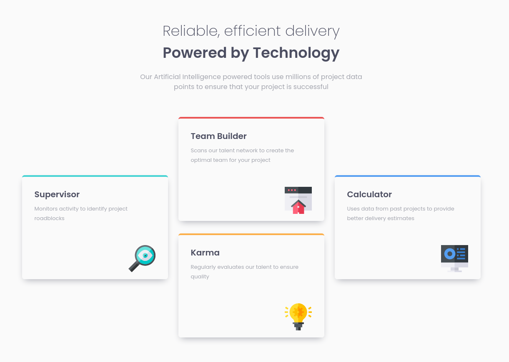

# Frontend Mentor - Four card feature section solution

This is a solution to the [Four card feature section challenge on Frontend Mentor](https://www.frontendmentor.io/challenges/four-card-feature-section-weK1eFYK). 

### The challenge

Users should be able to:

- View the optimal layout for the site depending on their device's screen size

### Screenshot

### Built with

- Semantic HTML5 markup
- CSS custom properties
- Flexbox
- Mobile-first workflow

## Author

TheGDneo
- Twitter - [@TheGDneo](https://twitter.com/TheGDneo)

**Note: Delete this note and add/remove/edit lines above based on what links you'd like to share.**

# four-card-feature-section
